# Executive Summary

## Purpose

A structured, repeatable approach for migrating an enterprise application portfolio from on-premises (or another cloud) to AWS — minimizing risk, downtime, and cost while setting up a landing zone that scales beyond the initial migration.

## Scope of a typical engagement

- **Discovery & Assessment** of the existing estate (servers, apps, databases, dependencies, licensing, compliance constraints).
- **Business case** — TCO comparison, cost avoidance, and a wave-based migration roadmap.
- **Landing zone build** — multi-account AWS foundation (networking, security, identity, governance) that all migrated workloads land into.
- **Migration execution** — wave-by-wave migration using the 6 R's, with a "migration factory" operating model for repeatability at scale.
- **Modernization** — post-migration optimization (rightsizing, managed services adoption, cost, resilience, security posture).
- **Decommission** — data center exit, license termination, hardware disposal.

## Success metrics (typical KPIs)

| Metric | Target |
|---|---|
| Migration velocity | X servers/apps migrated per wave (baseline, then improve wave-over-wave) |
| Unplanned downtime during cutover | 0 critical incidents; < defined RTO per app tier |
| Cost variance vs. business case | within ±10% of Migration Evaluator/TCO estimate |
| Security/compliance posture | 100% of workloads pass Landing Zone guardrails (SCPs, Config rules) before go-live |
| Rollback rate | < 5% of cutovers require rollback |
| Post-migration optimization | ≥ 20% cost reduction within 90 days via rightsizing + Savings Plans |

## Guiding principles

1. **Landing zone first.** Never migrate a workload into an account without guardrails (SCPs, logging, IAM baseline, network segmentation) already in place.
2. **Classify before you move.** Every app gets a 6 R's decision *before* it's scheduled into a wave — see [docs/02-6r-migration-strategies.md](02-6r-migration-strategies.md).
3. **Wave planning beats big-bang.** Group apps into waves by dependency, complexity, and business risk — not just by team or org chart.
4. **Test the rollback, not just the cutover.** Every runbook has a documented, rehearsed rollback path.
5. **Migrate, then modernize.** Rehost/replatform to stop the DC cost clock first; refactor later once the app is safely in AWS and under observability.
6. **Automate the factory.** Anything done more than twice (agent install, replication monitoring, cutover checklist) gets scripted or templated.

## Program structure at a glance

```mermaid
flowchart LR
    A[Assess] --> B[Mobilize]
    B --> C[Migrate & Modernize]
    C --> D[Optimize & Operate]

    subgraph A[Assess]
      A1[Discovery]
      A2[Portfolio 6R classification]
      A3[Business case / TCO]
    end
    subgraph B[Mobilize]
      B1[Landing zone build]
      B2[Wave planning]
      B3[Migration factory setup]
    end
    subgraph C[Migrate and Modernize]
      C1[Wave execution: Rehost/Replatform/Repurchase/Refactor]
      C2[Cutover and validation]
      C3[Decommission source]
    end
    subgraph D[Optimize and Operate]
      D1[Rightsizing / Savings Plans]
      D2[Well-Architected review]
      D3[Ongoing FinOps and SecOps]
    end
```

Continue to [docs/02-6r-migration-strategies.md](02-6r-migration-strategies.md).
