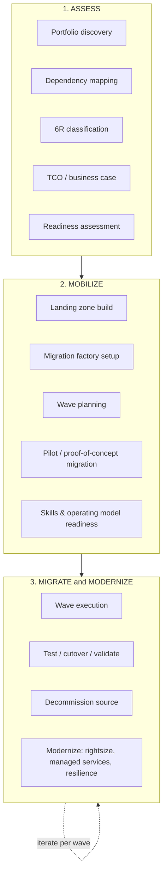

# End-to-End Migration Methodology

Maps AWS's **Migration Phases** (Assess → Mobilize → Migrate & Modernize) onto the **AWS Cloud Adoption Framework (CAF)** perspectives (Business, People, Governance, Platform, Security, Operations) so every workstream — not just infrastructure — is covered.

---

## Phase 1 — Assess (typically 4–8 weeks)

| Activity | Tooling | Output |
|---|---|---|
| Server/app discovery (agentless or agent-based) | AWS Application Discovery Service, Migration Evaluator | Inventory of servers, utilization, dependencies |
| Dependency mapping | ADS dependency mapping, network flow logs | App dependency graph (avoid breaking hidden integrations) |
| Database/application deep-dive | AWS SCT assessment reports | Compatibility scores, schema conversion effort |
| 6R classification | Workshops, [App Assessment Template](../templates/app-assessment-template.md) | Per-app migration strategy |
| Business case / TCO | AWS Migration Evaluator, Pricing Calculator | 3–5 year TCO comparison, executive business case |
| Security & compliance baseline | AWS Config, current-state audit | List of guardrails the landing zone must enforce |

**Exit criteria:** Signed-off inventory, 6R decision per app, approved business case, initial wave groupings.

## Phase 2 — Mobilize (typically 6–10 weeks)

| Activity | Tooling | Output |
|---|---|---|
| Landing zone build | AWS Control Tower, Organizations, Terraform/CloudFormation | Multi-account foundation — see [HLD Landing Zone](04-hld-landing-zone.md) |
| Network foundation | Transit Gateway, Direct Connect/VPN, Route 53 | Hybrid connectivity live and tested |
| Security baseline | SCPs, GuardDuty, Security Hub, IAM Identity Center | Guardrails enforced account-wide |
| Migration factory setup | MGN, DMS, App2Container, Migration Hub | Repeatable tooling + runbooks ready |
| Wave planning | Dependency graph + business calendar | Finalized wave sequence with dates |
| Pilot migration | 1–2 low-risk, representative apps | Validated runbook, lessons learned before scaling |

**Exit criteria:** Landing zone passes security review, pilot wave successfully migrated and validated, factory runbooks proven.

## Phase 3 — Migrate & Modernize (rolling, wave by wave)

Each wave repeats this cycle — detailed step-by-step in [Execution Runbook](11-execution-runbook.md):

1. **Pre-migration validation** — replication/connectivity test, backup verified, rollback plan signed off.
2. **Replicate** — MGN continuous replication / DMS CDC / data sync running and lag monitored.
3. **Test migration** — non-disruptive test launch in an isolated VPC; functional + performance validation.
4. **Cutover** — scheduled maintenance window, final sync, DNS/traffic switch, smoke test.
5. **Post-cutover validation** — App owner sign-off, monitoring confirms healthy for the agreed bake period (typically 48–72h).
6. **Decommission source** — after bake period, terminate source replication, then decommission the source server per [Retire runbook](10-lld-retire-retain.md).
7. **Modernize (where applicable)** — rightsizing, Reserved Instances/Savings Plans, managed-service adoption, Well-Architected review.

**Exit criteria per wave:** All apps in the wave signed off by app owners, no P1/P2 incidents open, source decommissioned or scheduled.

## Phase 4 — Optimize & Operate (continuous, post go-live)

- **Cost:** Compute Optimizer rightsizing recommendations, Savings Plans/RI purchase, tagging & Cost Explorer allocation — see [Risk & Cost Optimization](14-risk-cost-optimization.md).
- **Resilience:** AWS Resilience Hub assessment against defined RTO/RPO.
- **Security:** Recurring Well-Architected Security pillar review, GuardDuty/Security Hub findings triage.
- **Operations:** Handover to BAU ops team — runbooks, on-call, dashboards, SLOs.

---

## Wave planning principles

- **Group by dependency, not by org chart.** Apps that talk to each other synchronously should migrate in the same or adjacent waves.
- **Front-load a pilot wave** of low-risk, medium-complexity apps to prove the factory before committing dates for Tier-1 systems.
- **Balance risk across waves** — don't put all Tier-1/high-complexity apps in the last wave under deadline pressure.
- **Respect business blackout periods** (financial close, seasonal peaks) — bake this into the wave calendar up front.
- **Size waves to factory throughput**, not to arbitrary calendar chunks — measure velocity from the pilot and adjust.

## RAID log

Track Risks, Assumptions, Issues, Dependencies at the program level from day one — template in [`templates/raid-log-template.md`](../templates/raid-log-template.md). Review weekly in the migration factory stand-up.

Continue to [HLD — Landing Zone](04-hld-landing-zone.md).
