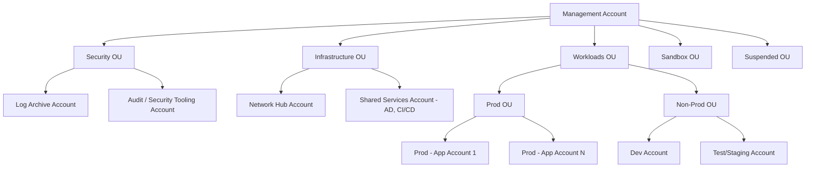
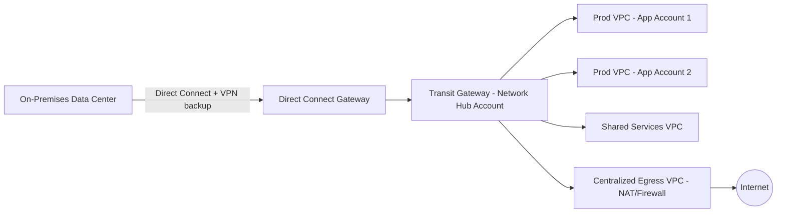

# HLD — Landing Zone & Account Architecture

Every migrated workload lands into this foundation. Build and harden it **before** the first production cutover.

## 1. Multi-account structure (AWS Organizations + Control Tower)

| Account/OU | Purpose |
|---|---|
| Management | Organizations root, billing, SCP authoring — no workloads |
| Log Archive | Centralized, immutable CloudTrail/Config/VPC Flow Logs (S3 + Glacier lifecycle) |
| Audit/Security Tooling | GuardDuty, Security Hub, Detective delegated admin |
| Network Hub | Transit Gateway, Direct Connect Gateway, centralized egress (NAT/firewall) |
| Shared Services | AD Connector/Managed AD, CI/CD, artifact repos, patch management |
| Workloads — Prod / Non-Prod | One account per application or app-group, split prod/non-prod for blast-radius isolation |
| Sandbox | Free-play, auto-expiring, no path to production data |

**Why per-app(-group) accounts:** blast-radius isolation, clean cost allocation, independent SCP/IAM boundaries, and simplest possible decommission (delete the account when the app retires).

## 2. Network architecture

- **Connectivity:** Direct Connect (primary) + Site-to-Site VPN (backup/failover) into a Direct Connect Gateway → Transit Gateway.
- **Segmentation:** One VPC per workload account, connected via Transit Gateway attachments; TGW route tables enforce which VPCs can talk to which (e.g., prod cannot route to non-prod).
- **Egress:** Centralized egress VPC with AWS Network Firewall / NAT gateways — single choke point for outbound internet, easier to monitor and control.
- **DNS:** Route 53 Resolver with forwarding rules for hybrid DNS resolution (on-prem ↔ AWS) during coexistence period.
- **CIDR planning:** Non-overlapping RFC1918 ranges across on-prem and every AWS VPC, planned before wave 1 — retrofitting CIDR overlap later is expensive.

## 3. Identity & access

- **AWS IAM Identity Center (successor to AWS SSO)** federated to on-prem Active Directory (AD Connector or two-way trust with AWS Managed Microsoft AD) — single sign-on into all accounts.
- **Permission sets** mapped to job function (MigrationEngineer, AppOwnerReadOnly, SecurityAuditor, BreakGlassAdmin) — no long-lived IAM users/access keys for humans.
- **Break-glass accounts**: emergency access procedure, hardware MFA, alerts on use.
- **Workload identity:** IAM roles for EC2/ECS/Lambda — no embedded credentials, ever.

## 4. Security & governance baseline

| Control | Service | Enforced at |
|---|---|---|
| Preventive guardrails (deny risky actions) | Service Control Policies (SCPs) | OU level |
| Detective guardrails (config drift) | AWS Config + Conformance Packs | Account level, aggregated to Audit account |
| Threat detection | GuardDuty (delegated admin) | Org-wide, aggregated to Audit account |
| Posture management | Security Hub (CIS/AWS Foundational standards) | Org-wide |
| Centralized logging | CloudTrail (org trail) + VPC Flow Logs → Log Archive account, S3 + Glacier | Org-wide |
| Encryption | KMS CMKs per account/workload, mandatory encryption SCPs | Account level |
| Vulnerability management | Amazon Inspector | Workload accounts |

## 5. Landing zone build sequence

1. Set up AWS Organizations + Control Tower, define OU structure.
2. Deploy Log Archive + Audit accounts, enable org-wide CloudTrail/Config/GuardDuty/Security Hub.
3. Build Network Hub account: Transit Gateway, Direct Connect/VPN, centralized egress.
4. Establish hybrid identity: AD trust/connector + IAM Identity Center permission sets.
5. Author baseline SCPs (deny root user actions, deny leaving org, require encryption, region restrictions).
6. Vend first workload account via Account Factory (Control Tower) — this is the template every future app account clones.
7. Security review / guardrail validation **before** any workload account receives production traffic.

## 6. Infrastructure as Code

- **Landing zone + guardrails:** Control Tower (account vending) + Terraform or CloudFormation/CDK for anything Control Tower doesn't manage (custom SCPs, Transit Gateway route tables, Config rules).
- **Per-app infrastructure:** Terraform/CDK modules, one repo per app or a shared module library — never console-click production infrastructure.
- **State/versioning:** remote state (S3 + DynamoDB lock, or Terraform Cloud), peer-reviewed via PR before apply.

Continue to [HLD — Migration Factory](05-hld-migration-factory.md).
