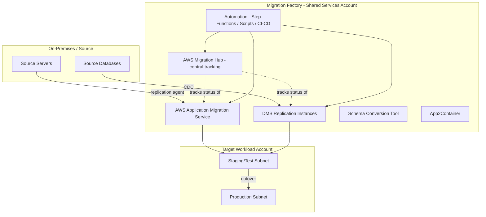

# HLD — Migration Factory

The "migration factory" is the operating model + toolchain that lets you migrate waves of applications repeatably, instead of treating every server as a bespoke project.

## 1. Factory architecture

## 2. Core components

| Component | Role |
|---|---|
| **AWS Migration Hub** | Single pane of glass — tracks every server/app's migration status across MGN, DMS, and other tools, per wave |
| **AWS Application Migration Service (MGN)** | Rehost engine — agent-based continuous replication, test/cutover launch templates |
| **AWS DMS + SCT** | Database replication (homogeneous and heterogeneous) with CDC for minimal-downtime cutover |
| **AWS App2Container** | Containerize existing Java/.NET apps into ECR images + ECS/EKS task defs, no code change |
| **Orchestration layer** | Step Functions / scripts / CI-CD pipeline that drives repeatable steps: agent install → replication check → test launch → validation → cutover → decommission |
| **Landing zone (from doc 04)** | Target accounts/VPCs every wave migrates into |

## 3. Factory roles (staffing model)

| Role | Responsibility |
|---|---|
| Migration Lead | Owns wave plan, cross-team coordination, go/no-go decisions |
| Cloud Migration Engineers | Run the tooling — agent installs, replication monitoring, test/cutover execution |
| Application Owners | Validate functional correctness pre/post cutover, sign off go-live |
| DBAs | Own DMS/SCT configuration, schema validation, data integrity checks |
| Network/Security Engineers | Firewall rules, security group mapping, connectivity troubleshooting |
| Cutover Coordinator | Runs the cutover bridge call, tracks the runbook checklist in real time |

Full RACI in [docs/13-raci-governance.md](13-raci-governance.md).

## 4. Factory throughput model

Measure and improve wave-over-wave:

- **Pilot wave:** establish baseline (e.g., 10 servers / 2 weeks with 4 engineers).
- **Automate the repeat steps:** agent deployment via SSM/scripts, replication health checks via CloudWatch alarms/dashboards, standard test-launch validation scripts.
- **Scale wave size** as automation reduces per-server manual effort — target increasing velocity each wave, not constant velocity.
- **Track a factory dashboard:** servers in each MGN/DMS state (not started / replicating / ready for test / tested / cutover complete) via Migration Hub, reviewed daily in factory stand-up.

## 5. Environments used during migration

| Environment | Purpose |
|---|---|
| Replication/staging subnet | Where MGN test instances and DMS target databases first land — isolated, no production traffic |
| Test/UAT | App owner functional + performance validation against the migrated instance before cutover |
| Production | Final cutover target — traffic switched via DNS/load balancer only after test sign-off |

## 6. Connectivity requirements for the factory

- Outbound HTTPS (443) from source servers to MGN replication endpoints (via Direct Connect/VPN, not public internet, for production data).
- DMS replication instance needs network line-of-sight to both source DB (via VPN/DX) and target DB (VPC).
- Sufficient Direct Connect/VPN bandwidth provisioned for peak replication throughput — undersized links are the most common cause of missed cutover windows.

Continue to per-strategy LLDs, starting with [LLD — Rehost](06-lld-rehost.md).
