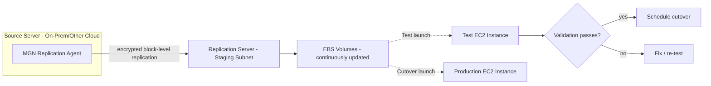

# LLD — Rehost (Lift & Shift) via AWS MGN

## 1. Architecture

## 2. Step-by-step execution

1. **Prerequisites**
   - Target VPC/subnets, security groups, IAM role for MGN, staging area subnet provisioned in the landing zone.
   - Source server has outbound HTTPS access to MGN replication endpoints (via Direct Connect/VPN).
   - Initialize AWS Application Migration Service in the target region/account.

2. **Install replication agent**
   - Install the MGN agent on the source server (Linux/Windows), pointed at the target AWS account/region.
   - Agent begins **initial sync** (full block copy), then switches to **continuous, near-real-time replication** (CDC at the block level) — source stays live and untouched throughout.

3. **Configure launch settings** per source server in MGN:
   - Target instance type (or "right-size" recommendation from MGN), subnet, security groups, IAM instance profile, tags, licensing (BYOL vs. AWS-provided), EBS volume type/encryption.

4. **Monitor replication lag**
   - Track via Migration Hub / MGN console dashboard; alarm if lag exceeds threshold (e.g., > 30 min) — indicates bandwidth or agent issue that must be fixed before test/cutover.

5. **Test launch (non-disruptive)**
   - Launch a test instance from current replicated data into an **isolated test subnet** (no production traffic, source keeps replicating in the background).
   - Run functional smoke tests, performance checks, security group/connectivity validation.
   - Mark server "Ready for cutover" in MGN once app owner signs off. Terminate the test instance (replication continues).

6. **Cutover**
   - Schedule maintenance window; notify stakeholders.
   - Freeze changes on source (or accept the small delta captured by final sync).
   - Launch the **cutover instance** from the latest replicated data.
   - Re-point DNS / load balancer / connection strings to the new instance.
   - Run the same smoke-test checklist used in test launch.

7. **Post-cutover bake period**
   - Monitor for 48–72h (CloudWatch, application logs, error rates) before finalizing.
   - Keep source server powered off (not deleted) during bake period as instant rollback path.

8. **Finalize / decommission**
   - After successful bake period, mark migration complete in MGN, disconnect the agent, decommission the source per [Retire runbook](10-lld-retire-retain.md).

## 3. Rollback plan

- **Trigger conditions:** critical functional failure, unacceptable performance degradation, data integrity issue discovered post-cutover.
- **Rollback action:** re-point DNS/load balancer back to the (still powered-on) source server; investigate root cause before re-attempting cutover.
- **Rollback window:** defined per app tier in the cutover runbook (e.g., Tier-1 apps keep source on standby for 7 days, not just 48h).

## 4. Right-sizing during rehost

- Use MGN's / Compute Optimizer's instance-type recommendations based on actual observed CPU/memory utilization from discovery — don't just match on-prem specs 1:1 (typically over-provisioned).
- Flag oversized sources as **rightsize-at-migration** candidates rather than deferring to post-migration optimization — cheaper to do it once.

## 5. Checklist (also see [Execution Runbook](11-execution-runbook.md))

- [ ] Target account/VPC/subnet/SG provisioned and guardrail-compliant
- [ ] MGN agent installed, initial sync complete
- [ ] Replication lag within threshold for ≥ 24h before test launch
- [ ] Test launch validated and signed off by app owner
- [ ] Cutover runbook reviewed, rollback plan documented and rehearsed
- [ ] Maintenance window communicated to stakeholders
- [ ] Cutover executed, smoke tests passed
- [ ] Bake period monitored, no P1/P2 incidents
- [ ] Source decommissioned per Retire runbook

Next: [LLD — Replatform](07-lld-replatform.md).
