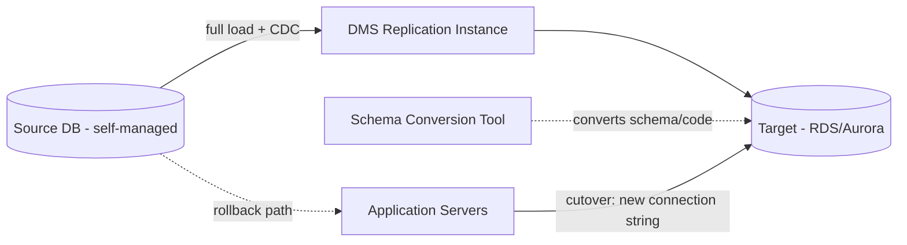
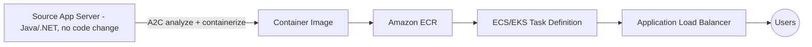

# LLD — Replatform (Lift-Tinker-Shift)

Covers the two most common replatform patterns: **database replatform via DMS/SCT** and **app-server containerization via App2Container**.

## Pattern A — Database replatform (e.g., self-managed MySQL/PostgreSQL/SQL Server/Oracle → RDS/Aurora)

### Architecture

### Steps

1. **Assessment (SCT):** Run AWS Schema Conversion Tool assessment report — for homogeneous moves (MySQL→RDS MySQL) this is close to zero-conversion; for heterogeneous moves (Oracle→Aurora PostgreSQL) it flags stored procedures, triggers, and proprietary SQL that need manual rework. Get a compatibility % score before committing a wave date.
2. **Schema conversion:** SCT converts schema + code objects automatically where possible; manually rewrite flagged objects (often the majority of the effort for heterogeneous engine changes).
3. **Provision target:** RDS/Aurora instance in the target VPC — right size, Multi-AZ, encryption at rest (KMS), automated backups, parameter group tuned to match source behavior.
4. **Full load:** DMS performs the initial bulk data copy.
5. **CDC (change data capture):** DMS replicates ongoing changes from source to target continuously, keeping the target in sync while the source stays live.
6. **Validation:** DMS data validation feature (row counts, checksums) + application-level smoke tests against the target as read-only.
7. **Cutover:** Brief write-freeze on source (or accept CDC catch-up delta), point application connection strings to the target, verify replication lag = 0, resume writes on target.
8. **Post-cutover monitoring:** Query performance, connection pool behavior, replication/backup jobs — bake period before decommissioning source (48–72h minimum, longer for Tier-1).
9. **Decommission source DB** per [Retire runbook](10-lld-retire-retain.md).

### Checklist

- [ ] SCT assessment report reviewed, manual conversion items closed
- [ ] Target RDS/Aurora provisioned, encrypted, right-sized, Multi-AZ
- [ ] DMS full load complete, data validation passed
- [ ] CDC lag near-zero and stable before cutover
- [ ] App connection strings/secrets updated (Secrets Manager rotation tested)
- [ ] Cutover smoke tests + query performance baseline compared to source
- [ ] Rollback plan (revert connection string) documented and rehearsed

---

## Pattern B — App-server containerization (App2Container)

### Architecture

### Steps

1. Run **App2Container** on the source server to analyze the running application (Java/.NET) and auto-generate a container image + ECS task definition / Kubernetes manifest — no source code changes required.
2. Push the image to **Amazon ECR**.
3. Deploy to **ECS (Fargate or EC2 launch type) or EKS** in the target VPC, behind an Application Load Balancer.
4. Wire up environment-specific configuration (Secrets Manager/Parameter Store) instead of hardcoded config files.
5. Test-launch the containerized app in a staging environment; run the same functional/performance validation as the source.
6. Cut over by shifting the load balancer/DNS target from the source app server to the new ECS/EKS service (can be done as a weighted/canary shift for lower risk).
7. Bake period, then decommission the source app server.

### Checklist

- [ ] A2C analysis completed, image builds and runs cleanly in staging
- [ ] Task definition sized correctly (CPU/memory) based on observed utilization
- [ ] Secrets/config externalized (no hardcoded credentials baked into the image)
- [ ] ALB health checks passing, target group draining configured for safe deploys
- [ ] Canary/weighted cutover plan (if used) documented with rollback weight-shift
- [ ] Bake period monitored, source decommissioned

Next: [LLD — Repurchase](08-lld-repurchase.md).
