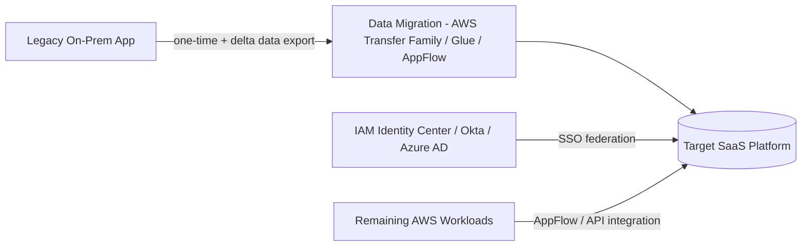

# LLD — Repurchase (Drop & Shop / Move to SaaS)

Example scenario used throughout: replacing a self-hosted CRM/HR/ticketing system with a SaaS product (Salesforce, Workday, ServiceNow, Microsoft 365, etc.).

## 1. Architecture

## 2. Steps

1. **Vendor selection & contracting** (business-led, migration team advises on integration/data feasibility) — confirm SaaS supports required data volumes, API rate limits, and compliance requirements (data residency, SOC2, etc.).
2. **Data mapping:** Map legacy schema/fields to the SaaS's data model; identify fields with no direct equivalent (need business decision: drop, merge, or custom field).
3. **Integration design:** Identify every system currently integrated with the legacy app (upstream/downstream) — each needs a new integration path:
   - **AWS AppFlow** for managed, no-code data flows between AWS services/S3 and SaaS platforms (bi-directional, scheduled or event-driven).
   - Direct API integration (Lambda + API Gateway) for custom/complex integration logic.
4. **Identity federation:** Configure SSO from **IAM Identity Center** (or the enterprise IdP) to the SaaS platform via SAML/OIDC — avoid local SaaS credentials.
5. **Data migration (staged):**
   - Historical/bulk data: one-time ETL job (AWS Glue or vendor-provided import tool) into the SaaS.
   - Validate record counts, spot-check data integrity, reconcile against source.
6. **Parallel run:** Run legacy and SaaS side-by-side for a defined period; new transactions go to SaaS, legacy stays read-only for historical lookups.
7. **Cutover:** Redirect all users/integrations to the SaaS platform; freeze the legacy system to read-only or fully retire it.
8. **Change management:** User training, updated SOPs/runbooks, help-desk readiness — the biggest risk in Repurchase is adoption, not technology.
9. **Decommission legacy** per [Retire runbook](10-lld-retire-retain.md) once parallel-run/reconciliation period is complete and signed off.

## 3. Key risks & mitigations

| Risk | Mitigation |
|---|---|
| Data model mismatch (fields with no SaaS equivalent) | Resolve in data mapping workshop before migration, not during cutover |
| Integration breakage for downstream systems | Full dependency inventory from discovery phase; test every integration point in parallel-run |
| User adoption / process change resistance | Change management workstream in parallel with technical migration; training before cutover, not after |
| Vendor lock-in / exit strategy | Confirm data export capability and format from the SaaS before signing contract |
| Licensing cost surprises | Model SaaS per-seat/usage costs against actual usage patterns, not vendor estimates alone |

## 4. Checklist

- [ ] Data mapping signed off by business + SaaS admin
- [ ] SSO federation tested for all user roles/permission levels
- [ ] All upstream/downstream integrations re-pointed and tested
- [ ] Historical data migrated and reconciled (record counts, spot checks)
- [ ] Parallel-run period completed with no critical discrepancies
- [ ] User training completed, help desk briefed
- [ ] Legacy system frozen/decommissioned per Retire runbook

Next: [LLD — Refactor / Re-architect](09-lld-refactor.md).
