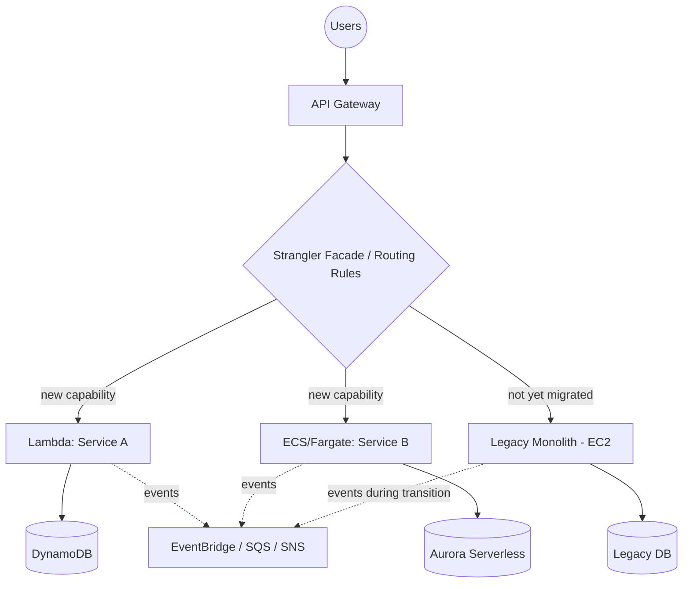

# LLD — Refactor / Re-architect

Highest effort, highest reward strategy. Always follow the **strangler-fig pattern** — incrementally carve functionality out of the monolith rather than a big-bang rewrite.

## 1. Target architecture (typical monolith → microservices/serverless)

## 2. Strangler-fig execution steps

1. **Identify seams:** Find bounded contexts in the monolith (order management, billing, inventory, etc.) using domain-driven design — these become candidate microservices.
2. **Stand up the facade:** Introduce API Gateway (or an ALB-based routing layer) in front of the monolith; initially, 100% of traffic routes through to the monolith unchanged.
3. **Extract one capability at a time:**
   - Build the new service (Lambda/ECS/Fargate) implementing that capability against its own data store.
   - Migrate/backfill the relevant data (dual-write or CDC from the legacy DB during transition).
   - Update the facade's routing rule to send that capability's traffic to the new service.
   - Decommission that capability inside the monolith once traffic is fully cut over and stable.
4. **Repeat** capability-by-capability until the monolith is empty (or only retains capabilities intentionally left as-is).
5. **Data decomposition:** Split the shared legacy database along the same service boundaries — each new service owns its own datastore (polyglot persistence: DynamoDB for high-throughput key-value, Aurora for relational, S3 for objects/documents).
6. **Decoupling:** Replace direct synchronous calls between new services with asynchronous events (EventBridge/SNS/SQS) wherever eventual consistency is acceptable — reduces cascading failure risk.
7. **Observability from day one:** Distributed tracing (AWS X-Ray), centralized logging (CloudWatch Logs / OpenSearch), and per-service dashboards — a microservices architecture without observability is undebuggable.

## 3. Design decisions to make explicitly

| Decision | Options | Guidance |
|---|---|---|
| Compute per service | Lambda vs. ECS/Fargate vs. EKS | Lambda for event-driven/spiky/low-ops; ECS/Fargate for steady-state, longer-running, or container-portability needs; EKS if the org already standardizes on Kubernetes |
| Data store per service | DynamoDB, Aurora/RDS, S3, ElastiCache | Match access pattern (key-value/high-scale → DynamoDB; relational/transactional → Aurora; caching → ElastiCache) |
| Sync vs. async communication | Direct API call vs. EventBridge/SQS/SNS | Sync only where the caller needs an immediate response; default to async for decoupling and resilience |
| API layer | API Gateway (REST/HTTP) vs. AppSync (GraphQL) | REST/HTTP for straightforward service APIs; AppSync when clients need flexible, aggregated queries |
| Deployment strategy | Blue/green, canary, rolling | Canary via weighted routing for high-risk services; blue/green for atomic cutovers |

## 4. Risk management specific to Refactor

- **Scope creep:** Lock the target architecture and service boundaries before starting build — refactor projects are the most prone to "while we're at it" scope expansion.
- **Data consistency during dual-write period:** Use CDC (DMS or Debezium-style change streams) rather than application-level dual writes where possible — reduces risk of drift between old and new data stores.
- **Team skills gap:** Serverless/microservices require different operational skills (distributed tracing, eventual consistency debugging) — budget for training/upskilling, not just tooling.
- **Longest timeline of the 6 R's:** Sequence refactor waves *after* the data-center-exit-critical apps have already been rehosted/replatformed, so there's no deadline pressure forcing architectural shortcuts.

## 5. Checklist

- [ ] Bounded contexts identified and agreed (domain-driven design workshop)
- [ ] Strangler facade in place, 100% traffic still routing to monolith initially
- [ ] Each extracted service has its own datastore, no shared-DB coupling to the monolith
- [ ] Data backfill/CDC validated for consistency before cutting routing over
- [ ] Observability (tracing, logging, dashboards, alarms) live for every new service before it takes production traffic
- [ ] Each capability's monolith code removed only after new service is stable in production
- [ ] Final state: monolith fully decommissioned or reduced to explicitly retained scope

Next: [LLD — Retire & Retain](10-lld-retire-retain.md).
