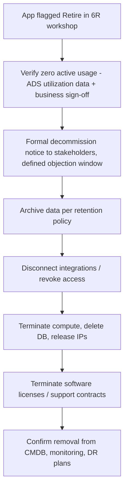
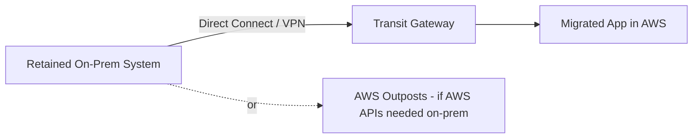

# LLD — Retire & Retain

## Part A — Retire

### Process

### Steps

1. **Verify before touching anything:** Confirm via Application Discovery Service utilization data (near-zero CPU/network activity over a sustained window) *and* explicit business sign-off — utilization data alone can miss quarterly/annual-use systems.
2. **Formal notice + objection window:** Send a decommission notice to all known stakeholders (from the dependency map) with a defined window (e.g., 2 weeks) to object before proceeding — catches undocumented dependents.
3. **Archive data per retention policy:** Export required data to low-cost, compliant storage (S3 Glacier / Glacier Deep Archive) with a defined retention period and encryption; document exactly what was archived and where.
4. **Disconnect integrations:** Remove/rotate any credentials, API keys, firewall rules, or scheduled jobs referencing the system.
5. **Decommission infrastructure:** Terminate EC2/on-prem servers, delete databases (after archive confirmed), release IP addresses/DNS records, remove load balancer listeners.
6. **Terminate licenses/contracts:** Cancel software licenses, support contracts, and any recurring third-party costs tied to the retired system — this is where a lot of "shadow" migration ROI is realized.
7. **Update records:** Remove from CMDB/asset inventory, monitoring/alerting, DR/BCP plans, and architecture diagrams.

### Checklist

- [ ] Zero-usage confirmed (data + business sign-off)
- [ ] Decommission notice sent, objection window closed with no valid objections
- [ ] Data archived per retention/compliance policy
- [ ] All integrations disconnected and credentials revoked
- [ ] Infrastructure terminated, licenses cancelled
- [ ] CMDB, monitoring, and DR documentation updated

---

## Part B — Retain

### When to formally retain (vs. just "not yet scheduled")

- Regulatory/data-residency constraint that blocks cloud hosting.
- Recent major CapEx investment not yet depreciated (revisit at depreciation end date).
- Tightly coupled to specialized on-prem hardware (lab equipment, industrial control systems).
- No clear business case yet — genuinely deprioritized, not a euphemism for "too hard."

### Hybrid architecture for retained systems that must integrate with migrated workloads

- **Standard case:** Direct Connect/VPN + Transit Gateway route table entries scoped tightly (least privilege) between the retained system's on-prem subnet and the specific AWS VPCs it must reach.
- **If the retained workload needs native AWS APIs/services on-premises** (e.g., low-latency requirement, data residency for storage but AWS compute desired): consider **AWS Outposts** rather than full retention on legacy infrastructure.

### Governance requirement

Every "Retain" decision must be logged with:

| Field | Example |
|---|---|
| Retained system | `Mainframe-Billing-01` |
| Reason | Regulatory data residency (finance data) |
| Revisit trigger | Regulatory change OR contract renewal date `2027-03-01` |
| Owner | App owner name + team |
| Hybrid connectivity required | Yes — DX to Prod VPC `vpc-xxxx`, port 443/1521 only |

Without a documented revisit trigger, "Retain" silently becomes permanent scope creep against the migration program's stated goals.

Next: [Execution Runbook](11-execution-runbook.md).
