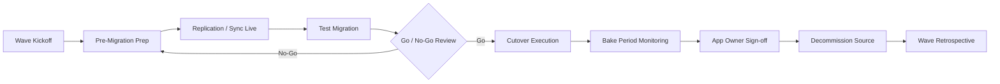

# Execution Runbook & Wave Checklists

Operational, day-of checklists for running a wave. Copy the [Cutover Runbook Template](../templates/cutover-runbook-template.md) per application/wave.

## Wave lifecycle

## 1. Wave kickoff (T-4 to T-2 weeks)

- [ ] Confirm app list and 6R assignment for the wave, no last-minute scope changes without Migration Lead approval
- [ ] Confirm target accounts/VPCs/subnets provisioned and guardrail-compliant
- [ ] Assign owners: migration engineer, app owner, DBA (if applicable), network/security contact
- [ ] Schedule maintenance windows with business calendar sign-off (avoid blackout periods)
- [ ] Communicate wave plan to all stakeholders (dependency map cross-check for anyone missed)

## 2. Pre-migration prep (T-2 weeks to T-2 days)

- [ ] Source server/DB access confirmed (credentials, firewall rules for replication traffic)
- [ ] MGN agent / DMS replication instance deployed and initial sync started
- [ ] Backup of source verified and restorable (independent of replication)
- [ ] Security group / NACL mapping from source to target documented and applied
- [ ] Rollback plan written and reviewed with app owner
- [ ] Runbook walkthrough (dry run) with all parties

## 3. Replication monitoring (ongoing until cutover)

- [ ] Replication lag within threshold, monitored via CloudWatch/Migration Hub dashboard
- [ ] Alarms configured for replication failure/lag breach
- [ ] Daily check-in during factory stand-up on wave status

## 4. Test migration (T-1 week to T-2 days)

- [ ] Test instance/database launched in isolated staging subnet
- [ ] Functional test suite executed (app owner-defined acceptance criteria)
- [ ] Performance baseline compared against source
- [ ] Security scan (Inspector) run against test instance
- [ ] Defects triaged and closed or explicitly accepted before go/no-go

## 5. Go / No-Go review (T-1 day)

Attendees: Migration Lead, App Owner, DBA, Network/Security, Cutover Coordinator.

- [ ] All test validations passed or defects accepted with sign-off
- [ ] Replication healthy and stable for required lookback window (e.g., 24–48h)
- [ ] Rollback plan confirmed and understood by all parties
- [ ] Maintenance window and comms confirmed
- [ ] **Decision recorded:** Go / No-Go / Conditional-Go (with conditions)

## 6. Cutover execution (maintenance window)

- [ ] Freeze changes on source (or note accepted delta window)
- [ ] Final sync / final replication confirmed caught up
- [ ] Launch cutover instance / promote target database
- [ ] Update DNS / load balancer / connection strings
- [ ] Run smoke test checklist (defined per app ahead of time)
- [ ] Confirm monitoring/alerting active on new production resource
- [ ] Cutover Coordinator logs actual start/end time and any deviations from plan

## 7. Bake period (typically 48–72h; longer for Tier-1)

- [ ] Monitor error rates, latency, resource utilization against baseline
- [ ] No P1/P2 incidents open
- [ ] App owner performs business-process validation (not just technical smoke test)
- [ ] Source kept powered on (not deleted) as rollback path throughout bake period

## 8. Sign-off & decommission

- [ ] App owner formal sign-off recorded
- [ ] Migration Hub / tracking system updated to "Complete"
- [ ] Decommission ticket raised for source (per [Retire runbook](10-lld-retire-retain.md))

## 9. Wave retrospective

- [ ] What went well / what didn't — captured in the RAID log and factory playbook
- [ ] Update automation/scripts based on friction points found this wave
- [ ] Update throughput baseline for next wave's sizing

## Rollback decision matrix

| Severity | Example | Action |
|---|---|---|
| P1 — critical/data loss risk | Data corruption, security breach exposure | Immediate rollback, no discussion |
| P2 — major functional break | Core business function unusable | Rollback unless fix is trivial and verifiable within 30 min |
| P3 — minor/cosmetic | Non-critical feature degraded | Proceed, track as post-migration defect |

Continue to [Tools & Services Reference](12-tools-and-services.md).
